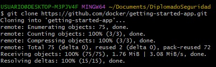

# Contenerización de una aplicación
En esta practica, se procederá a contenerizar una aplicación. Durante el proceso, se trabajará con un gestor de listas de tareas básico que opera en Node.js.

# Requisitos:

* Se debe tener instalada la última versión de Docker Desktop.
* Se ha de contar con un cliente Git instalado.
* Se necesita un IDE o editor de texto para editar archivos. Docker recomienda el uso de Visual Studio Code.
  
En resumen, se empaquetará la aplicación utilizando Docker y se trabajará con ella utilizando las herramientas mencionadas anteriormente.

1) Clonar el repositorio getting-started-app usando el comando:
   
| git clone https://github.com/docker/getting-started-app.git |
|-------------------------------------------------------------|

  

|

