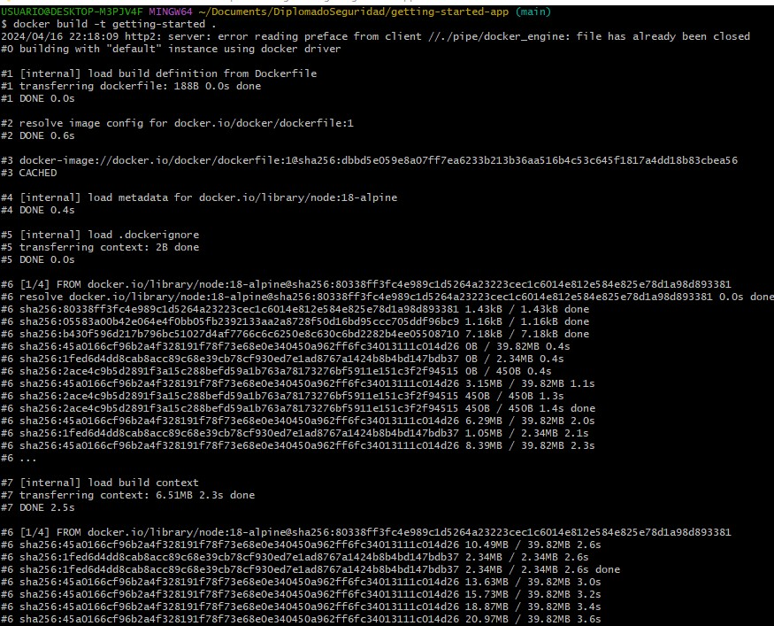

# Contenerización de una aplicación
En esta practica, se procederá a contenerizar una aplicación. Durante el proceso, se trabajará con un gestor de listas de tareas básico que opera en Node.js.

# Requisitos:

* Se debe tener instalada la última versión de Docker Desktop.
* Se ha de contar con un cliente Git instalado.
* Se necesita un IDE o editor de texto para editar archivos. Docker recomienda el uso de Visual Studio Code.
  
En resumen, se empaquetará la aplicación utilizando Docker y se trabajará con ella utilizando las herramientas mencionadas anteriormente.

# Obtener la aplicación
1) Clonar el repositorio getting-started-app usando el comando:
   
| git clone https://github.com/docker/getting-started-app.git |
|-------------------------------------------------------------|

  

  

# Construir la imagen de la aplicación
Un Dockerfile es como una receta de cocina para crear una imagen de contenedor. Es un archivo de texto que contiene una serie de instrucciones que Docker utiliza para construir automáticamente una imagen Docker. Especifica qué software y configuraciones se deben incluir en la imagen, así como cómo se deben configurar y ejecutar. Una vez que tienes un Dockerfile, Docker puede usarlo para construir una imagen de contenedor de manera consistente y reproducible.

1) Entrar en el repositorio clonado y crear un archivo vacío llamado Dockerfile

  

2)En un editor de codigo agregamos el siguiente codigo al archivo Dockerfile

  

3)Se construye la imagen usando el comando:

| docker build -t getting-started . |
|-----------------------------------|

  

Cuando se ejecuta el comando `docker build`, Docker utiliza el Dockerfile proporcionado para construir una nueva imagen. Si la imagen base especificada en el Dockerfile no está disponible localmente, Docker la descarga automáticamente. Luego, Docker sigue las instrucciones del Dockerfile, copiando los archivos de la aplicación, instalando dependencias (en este caso, usando `yarn`), y configurando el comando predeterminado que se ejecutará al iniciar un contenedor a partir de esta imagen (especificado por la directiva `CMD`).

La bandera `-t` permite etiquetar la imagen con un nombre que elijas, haciéndola fácilmente identificable. En este caso, la imagen se etiqueta como "getting-started". Al final del comando, el "." indica que Docker debe buscar el Dockerfile en el directorio actual.

En resumen, el comando `docker build` utiliza el Dockerfile para construir una imagen de contenedor, siguiendo las instrucciones especificadas en el Dockerfile y etiquetando la imagen resultante para facilitar su identificación.

# Iniciar un contenedor de aplicaciones

1) Ejecutar el comando:

| docker run -dp 127.0.0.1:3000:3000 getting-started |
|----------------------------------------------------|

   

